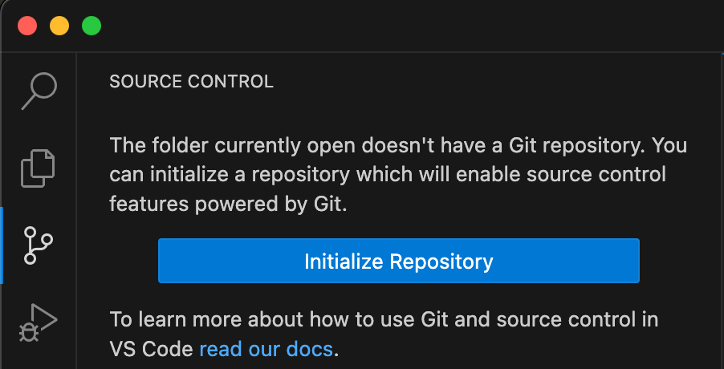
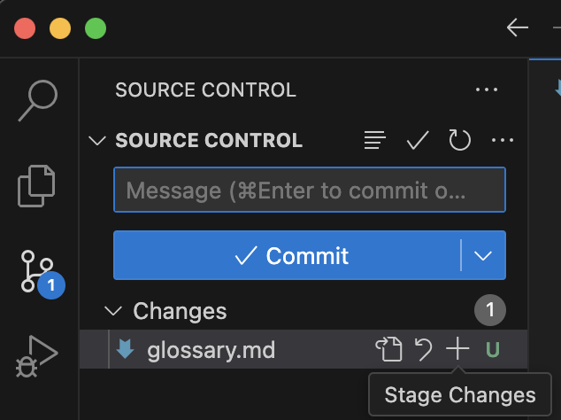
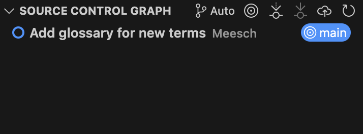

# Setting up
## Objectives
In this module, you will learn:

 - Why to use Git
 - How to initialize a Git repository
 - How to make a commit

/// details | prerequisites
    type: hint

You should have already created a Github account and installed VSCode (or another IDE).
///

## Version Control using Git
*Version Control* is one of the fundamental concepts in creating software. But what is version control, and why should you care? 

/// define
Version control

- a system that records changes to a file or set of files over time so that you can recall specific versions later.
///

When you have a history of your work, you can always go back to a previous version to restore lost functions, find out where bugs were introduced, and most importantly, blame whoever is at fault. [Git](https://git-scm.com/) is a version control system for tracking changes in computer files and coordinating work on those files among multiple people. Git allows for this by using **commits**, the building blocks of your history. It is primarily used for source code management in software development but it can be used to track changes in files in general - it is particularly effective for tracking text-based files (such as code files). Every change recorded by Git remains part of the project history and can be retrieved at a later date, so even if you make a mistake you can revert to a point before it.

/// define
Commit

- a data object which contains the changes made to the repository, the author of the changes, and the time+date of the changes. It has a unique identifier in SHA format, which can be used to refer back to this specific commit. It also includes a 'message': a description of the changes made in a short format.
///

/// details | What is a good commit? 
    type: tip

 - Commits should be small, logical units: every commit should only accomplish one thing
 - Commit early, commit often
 - Convention: write your messages using the imperative, e.g.:
    - `git commit -m "fix bug in analysis function"`
    - `git commit -m "add analysis feature"`
///

/// caption
[XKCD about commits](https://xkcd.com/1296/)
///

## Exercise: Create a repository
Create a sandbox repository on your own machine. You will use this repository to practice Git commands and have a playground where you can try anything you like. 

/// tab | Using the VSCode Git plugin

 - Step 1: Step 1: Create a directory called sandbox_NAME (replace NAME with your own name). Open this directory using VSCode (`Open Folder...`).
 - Step 2: In the Source Control tab (to the left), select 'Initialize Repository', this will automatically create a repository in a subdirectory called `.git`, which you can see if you run `ls -A` in the terminal.  
 - Step 3: Create a file called `glossary.md` (a [Markdown](https://www.markdownguide.org/) file), which you can use to write down new terms that you have learned during this course with their definitions. Add at least one term and its definition/explanation.
 - Step 4: Add the file to the staging area by clicking the `+` symbol next to the filename in the Source Control tab. 
 - Step 5: Commit the new file after typing a message into the text box.
 - Step 6: Check the commit history to confirm that it worked by selecting the Source Control Graph (at the bottom of the Source Control tab) 
///

/// tab | Using the command line

 - Step 1: Create a directory called `sandbox_NAME` (replace NAME with your own name)
 - Step 2: Run `git init` in this directory using the terminal: this will automatically create a repository in a subdirectory called `.git`, which you can see if you run `ls -A`.
 - Step 3: Create a file called `glossary.md` (a [Markdown](https://www.markdownguide.org/) file), which you can use to write down new terms that you have learned during this course with their definitions. Add at least one term and its definition/explanation.
 - Step 4: Add the file to the staging area: `git add glossary.md`
 - Step 5: Commit the new file: `git commit -m "<YOUR MESSAGE HERE>"`
 - Step 6: Check the commit history to confirm that it worked: `git log`
///

## Works cited:
https://carpentries-incubator.github.io/python-intermediate-development/14-collaboration-using-git.html
https://s3-school.github.io/s3-2026-lectures/2.2-git-and-github/main/
