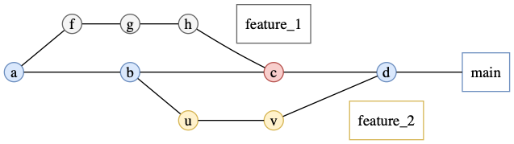
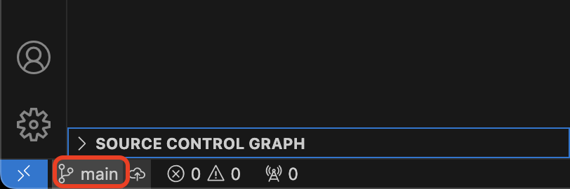
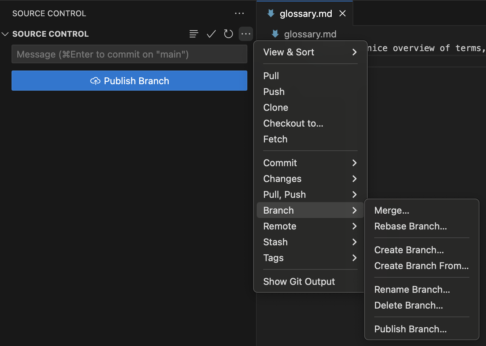

# Branching out
## Objectives
In this module, you will learn:

 - Why branches are useful
 - How to create and switch between branches
 - Common branch naming conventions
 - How to merge completed work back into the main branch

## What is a Git Branch?
When developing software, it is often useful to work on new features, bug fixes, or experiments without affecting the main version of the code. Git solves this problem using **branches**.

/// define
Branch

- an independent line of development within a Git repository. Each branch can contain its own commits and changes without affecting other branches.
///

By default, most repositories contain a branch called `main` (older repositories may call their main branch `master`). The `main` branch should represent a stable version of the project.

Another branch that is *almost* always present is `develop`. This contains the current development version of the code. Periodically, a new *release* publishes all the changes in `develop` to `main`. Consider `main` the latest stable version, and `develop` the current up-to-date version of the code.

Using branches makes it possible for multiple people to work on the same project simultaneously without interfering with one another's work. It also allows you to work on different features at the same time, although this should be avoided as much as possible, as it is easy to get confused when you have several branches in active development.

/// details | Why use branches?
    type: tip

 - Keep unfinished work separate from stable code
 - Allow multiple people to work on different tasks simultaneously
 - Make it easier to review changes before they become part of the main project
 - Reduce the risk of introducing bugs into the main branch
///

## Merge
Once the work has been completed and tested, the new branch can be merged back into `main`.

/// define
Merge

- the process of combining the changes from one branch into another branch. Git records the integration in the repository history.
///

Merging is where some of the real Git magic happens. When executing a merge, if everything goes well, your work will have seamlessly combined. Git harmonises changes in different files at different times by looking at the full edit history of each file, finding the latest common point in history for each file, and trying to execute all the changes from your branch to the file on the `main` branch.

/// details | Merging into main
    type: warning

When executing the merge command, ensure that you have checked out the branch that you want to merge the changes into, not the branch that you have been developing the new feature on.
///

## Typical Branch Workflow

A common workflow looks like this:

1. Start from an up-to-date `main` branch.
2. Create a new branch for your work.
3. Make commits on the new branch developing the functionality.
4. Test the new functionality.
5. Merge the branch back into `main`.
6. Delete the branch once it is no longer needed.

/// caption
Illustration of how branching and merging allows for simultaneous development. [J. Bresson](https://jmini.github.io/)
///

## Branch Naming Conventions

Although Git allows branches to be named almost anything, teams usually follow conventions so that branch names clearly communicate their purpose.

Common naming patterns include:

| Prefix | Purpose | Example |
|----------|----------|----------|
| `feature/` | New functionality | `feature/add-analysis-pipeline` |
| `bugfix/` | Fixing a defect | `bugfix/fix-date-parsing` |
| `hotfix/` | Urgent production fix | `hotfix/security-patch` |
| `docs/` | Documentation changes | `docs/update-installation-guide` |
| `refactor/` | Code restructuring without changing functionality | `refactor/reorganize-utilities` |
| `test/` | Adding or updating tests | `test/add-integration-tests` |

/// details | Naming recommendations
    type: tip

 - Use lowercase letters
 - Separate words using hyphens (`-`)
 - Make names descriptive but short
 - Avoid spaces and special characters
///

## Exercise: create and merge a feature branch
Create a new branch on which you will add some more terms to the glossary. 

//// tab | Using the VSCode Git plugin

 - Step 1: Open your sandbox repository in VSCode.
 - Step 2: Select the branch selector in the bottom-left corner of the window by clicking the branch name. 
 - Step 3: In the menu that will pop up at the top of your screen, choose **Create New Branch...** and name it `feature/add-entries`. VSCode will automatically switch to this newly created branch.
 - Step 4: Add at least two new terms to `glossary.md` and save the file.
 - Step 5: Commit your changes using the Source Control tab.
 - Step 6: Switch back to the `main` branch using the branch selector.
 - Step 7: Open the Source Control options (`...`, top right of menu) and select **Merge Branch...**. Choose `feature/add-entries`. 
 - Step 8: Verify that the new glossary entries are now visible on the `main` branch.
 - Step 9: Delete the feature branch using the branch management menu once the merge has completed. You must stay on the `main` branch to do this.
 
////
//// tab | Using the command line

 - Step 1: Navigate to the sandbox repository you created in the previous exercise.
 - Step 2: Confirm your current branch using `git branch` (to just give a branch name) or `git status` (to give an overview of repo status, including branch name).
 - Step 3: Create and switch to a new branch: `git checkout -b feature/add-entries` (the `-b` flag creates a new branch)
 - Step 4: Add at least two new terms to `glossary.md` and save the file.
 - Step 5: Stage and commit your changes.
 - Step 6: Verify that your new commit exists: `git log --oneline`
 - Step 7: Switch back to the main branch: `git checkout main`
 - Step 8: Merge your completed work: `git merge feature/add-glossary-entries`
 - Step 9: Confirm that the new glossary entries now exist on the `main` branch.
 - Step 10: Delete the feature branch: `git branch -d feature/add-entries`
/// details | Deleting branches
    type: tip

Don't worry about accidentally deleting an active branch: Git has a security barrier in place which disallows you from deleting unmerged branches. You can overwrite this security by using the `-D` flag.
///
////

## Works cited:
https://git-scm.com/book/en/v2/Git-Branching-Branches-in-a-Nutshell
https://carpentries-incubator.github.io/python-intermediate-development/14-collaboration-using-git.html
