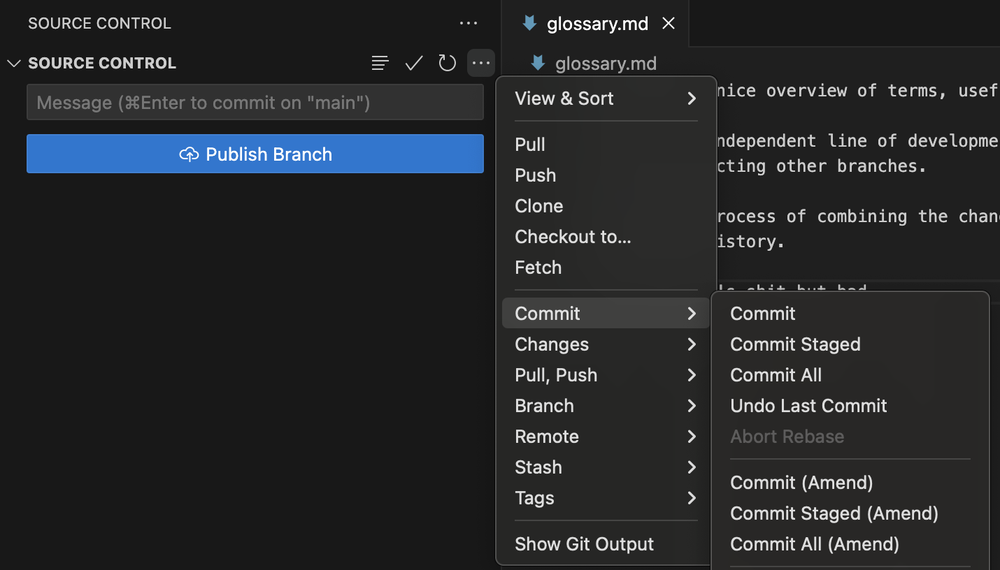
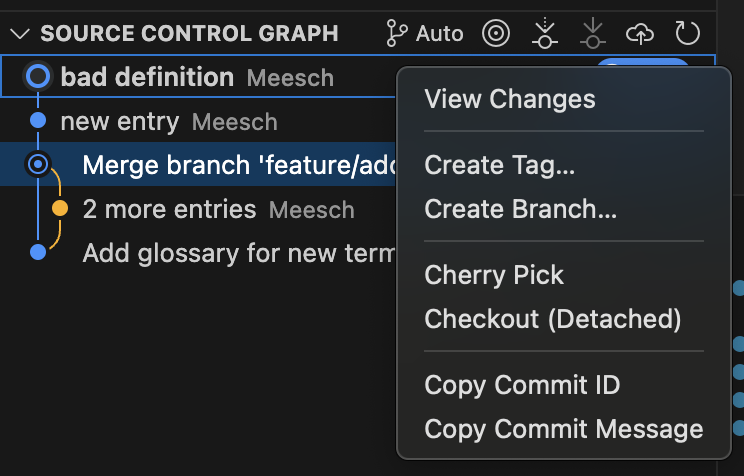
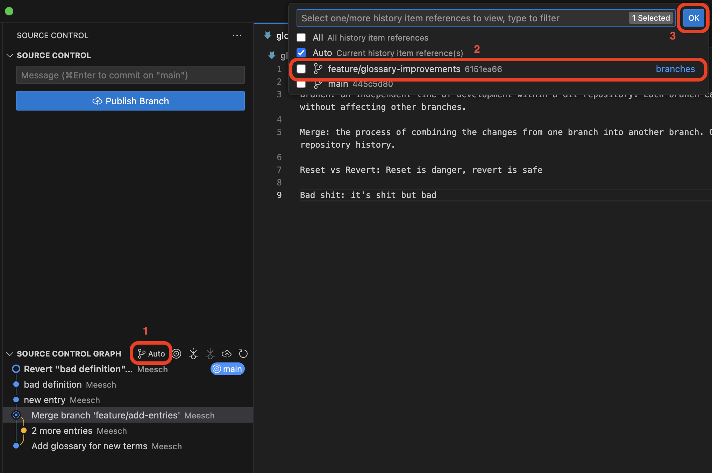
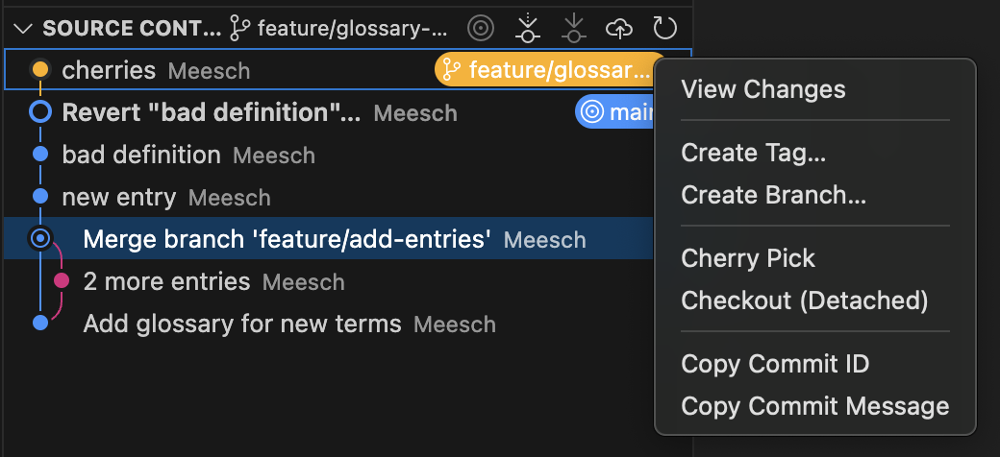
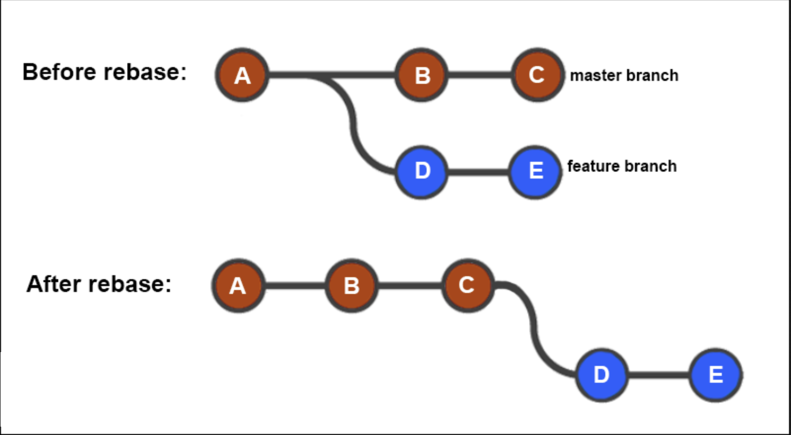
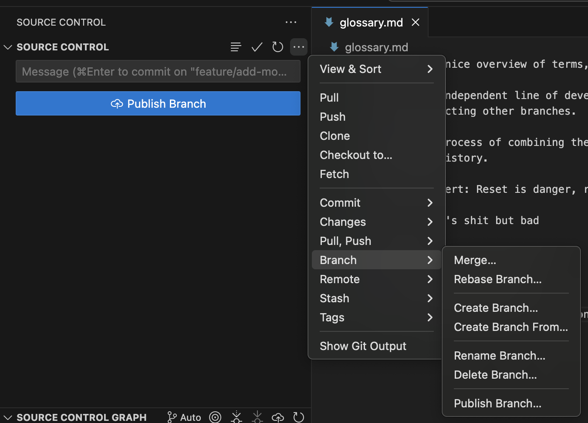
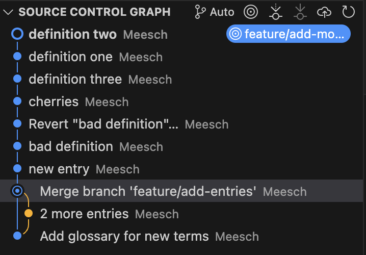

# Rewriting History
## Objectives
In this module, you will learn:

 - How to undo commits using `git reset`
 - How to safely reverse commits using `git revert`
 - How to move commits between branches using `git cherry-pick`
 - How to update a branch using `git rebase`

## Git Reset

`git reset` allows you to move the pointer of the current branch to a different commit, essentially walking back in time. Git has three main modes for resetting:

 - Mixed reset: `git reset --mixed` - keep changes in the working directory (no work is lost)
 - Soft reset: `git reset --soft` - keeps the changes and adds them to the staging area (no work is lost)
 - Hard reset: `git reset --hard` - discards all changes and overwrites files to the state from the intended commit (work is lost)

With `git reset` you can undo a commit that was made too early or with an incorrect commit message.

/// details | Rewriting history
    type: warning

Avoid using `git reset` on commits that have already been shared with collaborators unless you understand the consequences. Resetting rewrites project history.
///

## Exercise: undo a commit with git reset

//// tab | Using the VSCode Git plugin

 - Step 1: Open your `playground` repository.
 - Step 2: Add a new term to `glossary.md`.
 - Step 3: Commit the changes, but with a bad commit message.
 - Step 4: Open the Source Control options (`...`, top right of menu) and select **Commit... > Undo Last Commit** 
 - Step 5: Look at the Source Control menu: which mode for reset has been used?
 - Step 6: Create a new commit with a better message.

/// details | More reset modes?
    type: hint

When using the standard VScode extension for Git, the only option you have for resetting a commit is to undo the last commit in *soft mode*. With the command line (or more elaborate Git plugins) you can reset to any commit in history, and use the different modes. If you want to try those modes, use the command line.
///

////

//// tab | Using the command line

 - Step 1: Open your `playground` repository.
 - Step 2: Add a new term to `glossary.md`.
 - Step 3: Commit the changes, but with a bad commit message.
 - Step 4: View the commit history using `git log --oneline`.
 - Step 5: Undo the most recent commit while keeping the changes staged:

   `git reset --soft HEAD~1` or `git reset --soft <intended_commit_id>`

 - Step 6: Verify that the changes are still staged using `git status`.
 - Step 7: Commit the changes again using a better commit message.

////

## Git Revert

Unlike `git reset`, `git revert` does not remove commits from history. Instead, it creates a new commit that reverses the changes introduced by an earlier commit.

Because it preserves project history, `git revert` is often the preferred way to undo changes that have already been shared with others.

## Exercise: revert a commit

//// tab | Using the VSCode Git plugin

 - Step 1: Open your `playground` repository.
 - Step 2: Add a glossary entry that you do not intend to keep.
 - Step 3: Commit the change.
 - Step 4: Open the Source Control Graph.
 - Step 5: In the Source Control Graph menu, right-click the 'bad' commit and select **Copy Commit ID** 
 - Step 6: Now, using the built-in terminal, navigate to your playground directory.
 - Step 7: Revert the 'bad' commit using: `git revert <COMMIT_ID>` (you can paste the ID from your clipboard)
 - Step 8: Two things will happen: your terminal will open a text editor to handle the new commit, but VSCode will also recognize the new commit and show it in the Source Control Menu. For now, just commit the new commit using the VSCode plugin, then you can close the terminal again.
 - Step 9: verify that a new commit was created, reverting the bad commit.

////

//// tab | Using the command line

 - Step 1: Open your `playground_NAME` repository.
 - Step 2: Add a glossary entry called "Bad Definition".
 - Step 3: Commit the change.
 - Step 4: Locate the commit using `git log --oneline`.
 - Step 5: Copy the commit ID to your clipboard.
 - Step 5: Revert the commit:

   `git revert <COMMIT_ID>`

 - Step 6: A text editor will open with the full commit message for the revert commit. Git will finish comitting when you close the editor.
 - Step 6: Verify that Git creates a new commit.
 - Step 7: Confirm that the glossary entry has been removed.

////

## Git Cherry-pick

Sometimes you only want a single commit from another branch rather than all of the work on that branch. For example, when your colleague has fixed a bug on their branch, but that branch is not ready to merge yet, you can cherry-pick it into your own branch. This will create the commit on your own branch, and if you and your colleague both merge, two identical commits will show up in the history, the later one seemingly not changing anything. Usually this is fine, but it can be a cause of **merge conflicts**....

/// details | When is `cherry-pick` used?

By far the most common use case for `git cherry-pick` is to hotfix a bug on your branch #1 that has been fixed in branch #2. This will allow you to keep working on branch #1 with the bug fixed, without having to merge branch #2. For other purposes, `git merge` or `rebase` are preferred, as they keep the history linear, whereas `cherry-pick` creates a copied commit, which will show up twice in the history if both branches are merged into one.
///

## Exercise: cherry-pick (copy) a commit between branches

//// tab | Using the VSCode Git plugin

 - Step 1: Create a branch called `feature/glossary-improvements`.
 - Step 2: Add a new glossary term and commit it with commit message '`cherries`'.
 - Step 3: Copy the commit ID from the Source Control Graph.
 - Step 4: Switch back to `main`.
 - Step 5: Open the Source Control Graph.
 - Step 6: Using the branch selector menu (first button to the right of the Source Control Graph menu header that says 'auto'), select the `feature/glossary-improvements` branch and hit 'OK'. This will show the Source Control Graph for that branch in your current view. 
 - Step 7: Right click the cherries commit and select **Cherry Pick**. 
 - Step 8: Re-select 'auto' in the branch selector menu from step 6.
 - Step 9: Verify that the cherries commit has been committed on the main branch and that the glossary term has been added to the glossary file..

////

//// tab | Using the command line

 - Step 1: Create a branch called `feature/glossary-improvements`.
 - Step 2: Add a new glossary term and commit it with commit message '`cherries`'.
 - Step 3: Copy the commit ID using `git log --oneline`.
 - Step 4: Switch back to `main`.
 - Step 5: Run `git cherry-pick <COMMIT_HASH>`.
 - Step 7: Verify that the cherry-picked commit has been comitted on the main branch and that the glossary term has been added to the glossary file.

////

## Git Rebase (advanced)

Rebasing allows you to replay your branch on top of the latest version of another branch, creating a cleaner and more linear project history. It essentially *moves* the starting point of your branch to the last commit of the branch on which you are rebasing, and then applies all the changes from your branch *after* it.

/// details | Rewriting history
    type: warning

Avoid using `git rebase` on commits that have already been shared with collaborators unless you understand the consequences. Rebasing rewrites project history. Are you ready for that?
///

## Exercise: rebase a feature branch

//// tab | Using the VSCode Git plugin

 - Step 1: Create a branch called `feature/add-more-definitions`.
 - Step 2: Make two separate commits that add glossary terms (`definition one` and `definition two`).
 - Step 3: Switch back to `main`.
 - Step 4: Add another glossary term and commit it (`definition three`).
 - Step 5: Switch back to `feature/add-more-definitions`.
 - Step 6: Select **Branch... > Rebase Branch...** from the Source Control menu. 
 - Step 7: Choose `main` as the branch to rebase onto.
 - Step 8: Resolve merge conflict <--- TODO MAKE TUTORIAL ABOUT IT
 - Step 9: Inspect the Source Control Graph and observe that your feature branch now sits on top of the latest commit from `main`. It should look something like this: 

////

//// tab | Using the command line

 - Step 1: Create a branch called `feature/add-more-definitions`.
 - Step 2: Make two separate commits that add glossary terms (`definition one` and `definition two`).
 - Step 3: Switch back to `main`.
 - Step 4: Add another glossary term and commit it (`definition three`).
 - Step 5: Switch back to `feature/add-more-definitions`.
 - Step 6: Run `git rebase main`.
 - Step 7: Inspect the history using `git log --oneline --graph`.
 - Step 8: Observe that the feature branch commits now appear after the latest commit on `main`.

////

## Final exercise: think of a fix using Git
TODO: think  of it

## Works cited:
https://git-scm.com/book/en/v2/
https://carpentries-incubator.github.io/python-intermediate-development/14-collaboration-using-git.html
