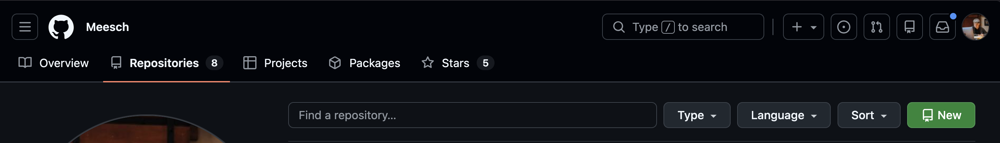
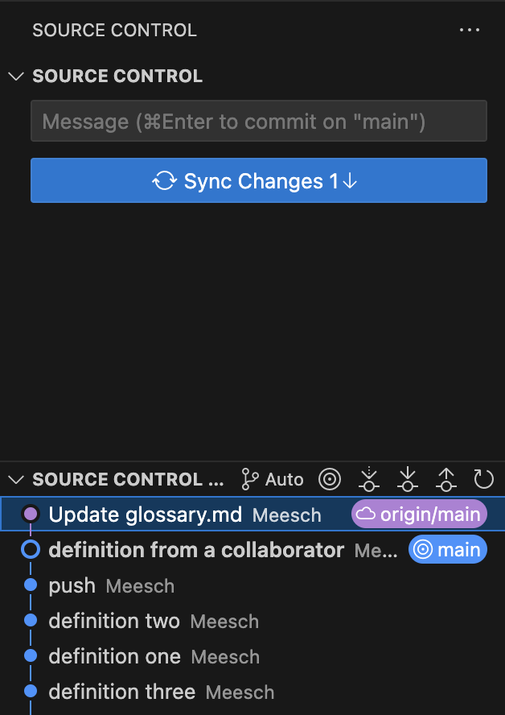

# Collaborating with Remote Repositories

## Objectives

In this module, you will learn:

 - The difference between local and remote repositories
 - How to synchronize changes using `git fetch`, `git pull`, and `git push`
 - How Pull Requests support collaborative development
 - How Issues can be used to track work and bugs

/// details | prerequisites
    type: hint

You should have completed the previous Git modules and have access to a Github account. You should also have a local repository (`playground_NAME`) available from earlier exercises. Finally, you should have connected your Github account to VSCode so that you can easily work on remote repositories.
///

## Local versus Remote Repositories

So far, all of your Git work has happened on your own machine. These repositories are called **local repositories**.

A local repository is fast, works without an internet connection, and gives you full control over your work. However, it has one important limitation: nobody else can see it.

To collaborate with others, we usually connect our local repository to a **remote repository** hosted on a service such as Github, GitLab, or Bitbucket. For the purposes of this course we will use Github.

A remote repository provides several advantages:

 - Collaboration between multiple contributors
 - Off-site backup of your work (in case of [emergency](https://thumbs.dreamstime.com/b/destroyed-computer-hard-drive-hammer-concept-data-deletion-cyber-security-breach-information-loss-protection-destruction-385680410.jpg?w=768))
 - Centralized review processes
 - Project management tools such as Issues and Pull Requests

/// details | Things to watch out for
    type: warning

A remote repository does not automatically stay synchronized with your local repository.

Changes made locally are not visible remotely until you `push` them.

Changes made remotely are not visible locally until you `fetch` and `pull` them.
///

The connection between a local and remote repository is often called a **remote**.

You can inspect configured remotes using:

`git remote -v`

Most repositories use a remote named `origin`.

## Pushing Changes

After making commits locally, you can upload them to the remote repository. The `git push` command publishes your work so that other collaborators can access it.

/// details | Push rejected?
    type: warning

If somebody else has pushed commits since your last synchronization, Git may reject your push.

In that case:

1. Pull the latest changes.
2. Resolve conflicts if necessary.
3. Push again.
4. Remember that you should try to keep your work on a separate branch and that sharing a single branch with someone else will almost **always lead to mishaps**.
///

### Exercise: the first push
In this exercise, you will create a remote for your local repository.

//// tab | Using the VSCode Git plugin

 - Step 1: Click **Publish Branch** in Source Control.
 - Step 2: Select **Publish to Github public repository** (yes it will be okay, you can make it private after the course is over).
 - Step 3: Verify that the repository appears on your Github page.

////

//// tab | Using the command line

 - Step 1: Go to your personal Github page > Repositories, and select New. 
 - Step 2: Create a new remote repository with the same name as your local sandbox repository
 - Step 3: After creation, go back to your local terminal, navigate to your working directory and run: `git remote add origin https://github.com/<YOUR_GITHUB_PROFILE>/sandbox_<YOUR_NAME>.git`
 - Step 4: `git checkout main`
 - Step 5: `git push -u origin main` 

/// details | the `-u` flag
    type: tip

 The `-u` flag in `git push -u origin <branch>` is a shorthand for `--set-upstream`. It creates a tracking reference that links your local branch to a specific remote branch, allowing you to use `git pull` or `git push` without arguments in the future. 
 ///

 - Step 6: Verify that the repository now is filled with your code on your Github page.
////

### Exercise: pushing to someone else's repo
In this exercise, you will clone someone else's repository and push a term to their glossary. First of all, find someone else and ask if they can send you the url to their remote git repository (e.g.: https://github.com/Meesch/sandbox_MEES.git). You can find the remote url here: !(github-clone)[https://github.com/Meesch/sandbox_MEES.git]


//// tab | Using the VSCode Git plugin

 - Step 1: Open a new VSCode window.
 - Step 2: under Start, select **Clone Git repository...**
 - Step 3: Paste the remote url in the pop-up bar
 - Step 4: Verify that you now have access to another sandbox repo!
 - Step 5: Add a definition to the glossary and commit it.
 - Step 6: Click **Sync Changes** to push your commit.


////
//// tab | Using the command line

 - Step 1: Run `git clone <REMOTE_URL>`
 - Step 2: Add a definition to the glossary and commit it.
 - Step 3: Run `git push`
////

## Fetching Changes

When other people make changes to a remote repository, your local repository does not automatically update.

To retrieve information about changes on the remote server without modifying your own work, use:

`git fetch`

/// define
Fetch

- the process of downloading commits, branches, and metadata from a remote repository without modifying your current files.
///

Think of `fetch` as asking:

> "What has changed on the server since I last checked?"

After fetching, you can inspect the new commits before deciding whether to  `pull` them. To pull a commit means to apply the remote commits to your local repository.

/// details | Fetch versus Pull
    type: tip

`git fetch` only downloads information, i.e. it checks for new commits and shows them to you.

`git pull` downloads the commits and immediately attempts to integrate it into your local repository.
///

## Pulling Changes

Once you have inspected the changes, you can integrate them into your current branch.

/// define
Pull

- the process of fetching changes from a remote repository and merging them into the current branch.
///

The command: `git pull` is effectively a shortcut for:

```bash
git fetch
git merge
```

After pulling, your local branch will be updated with the latest changes from the remote repository.

### Exercise: fetch and pull remote changes

//// tab | Using the VSCode Git plugin

 - Step 1: Ensure that a new commit exists on Github that is not yet present locally (ideally by giving someone else access to your repository).
 - Step 2: Open the Source Control menu (`...`).
 - Step 3: Select **Fetch**.
 - Step 4: Select the Source Control Graph again and observe that there is a new commit in the graph that is ahead of your current local pointer: 
 - Step 5: Click on the remote commit to see the changes made in that commit.
 - Step 6: If you approve of the changes, you can click **Sync Changes**

////

//// tab | Using the command line

 - Step 1: Ensure that a new commit exists on Github that is not yet present locally(ideally by giving someone else access to your repository).
 - Step 2: Run `git fetch`
 - Step 3: Look at the new commit that has come in by running `git log --oneline --all`
 - Step 4: Copy the commit ID from the remote commit and run `git diff <commit_id>` to see the changes made.
 - Step 5: If you approve of the changes, run `git pull`
 - Step 6: Verify that the changes have been made locally.

////


## Pull Requests

When working in teams, it is generally considered bad practice to commit directly to the `main` branch (like you have been doing so far). Instead, developers create a feature branch, complete their work, and then submit a **Pull Request**.

/// define
Pull Request (PR)

- a request to merge changes from one branch into another branch, usually accompanied by code review and discussion. You request to *pull* one branch into another. This terminology is proprietary to Github, Gitlab calls these *Merge Requests* for example.
///

Pull Requests provide:

 - An option to review changes and discuss them
 - Documentation of decisions
 - Automated testing


A typical workflow looks like this:

1. Create a feature branch.
2. Develop and commit changes.
3. Push the branch to Github.
4. Open a Pull Request.
5. Review and discuss the changes.
6. Merge the Pull Request.
7. Delete the feature branch.

### Exercise: create a Pull Request

 - Step 1: On someone else's repository, create a branch called `feature/add-glossary-entry`.
 - Step 2: Add a new glossary definition and commit the changes.
 - Step 3: Push the branch to Github.
 - Step 4: Open the Github repository in your browser and navigate to the **Pull Requests** tab.
 - Step 5: Select **New Pull Request**.
 - Step 6: Select your branch and the branch you want to merge into.
 - Step 7: Write a short title and description.
 - Step 8: Create the Pull Request.

### Exercise: Review a Pull Request
 - Step 9: Review the displayed changes that someone else proposed to your repo in a Pull Request.
 - Step 10: Merge the Pull Request.
 - Step 11: Delete the feature branch.
 - Step 12: Verify that the proposed changes have been made to the repository.

## Issues

Most collaborative software projects track planned work using Issues.

/// define
Issue

- a tracked task, bug report, enhancement request, or discussion item within a repository.
///

Many teams create an issue before starting work and then link a Pull Request or commit to that issue, using its ID. Moreover, you can link issues to one another. It helps teams keep track of the many features and bugs that still need to be addressed. 

For example, if you create `Issue #12: Add glossary search functionality`, you can use the ID `#12` in your commit message or Pull Request description, and they will be linked. Github can then automatically close Issues when a Pull Request is merged. This is not obligatory, you can also close issues manually.


## Works cited:

https://git-scm.com/book/en/v2/
https://docs.github.com/en/pull-requests
https://docs.github.com/en/issues
https://carpentries-incubator.github.io/python-intermediate-development/14-collaboration-using-git.html