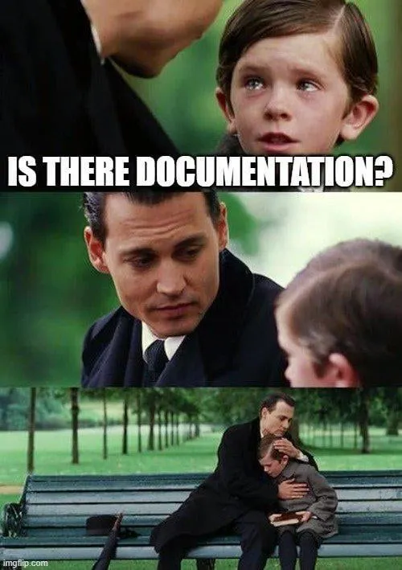

# Writing READMEs
## READMEs
README files are the first landing page for anyone who is looking at your code repository. It is always called README, can be a markdown (.md) or text (.txt) file, and should answer three questions:
    
1. Why should I use this software? 
2. How do I use this software?
3. How can I install this software?

Many READMEs have a similar structure, and developers have come to expect this structure to be present in READMEs, leading to a nice unenforced standard. This structure usually looks like this:

 - Descriptive title 
 - Motivation (why did we develop this, why should you use it?)
 - How to setup/install
 - Copy-pastable quick start code example
 - Link or instructions for contributing (see also CONTRIBUTING.md)
 - License
 - Recommended citation (see also CITATION.cff)

/// details | Different README examples
    type: tip

Different software repos need different READMEs: find some examples of types of README styles here:

1. Basic README: [TextMiNER](https://github.com/CentreForDigitalHumanities/TextMiNER). Answers the questions, and little else. Perfect for libraries like TextMiNER, which have a single purpose and very well-defined in- and outputs. As this package would only be used by other technical researchers or developers, it does not waste time with unnecesarry information that can be learned from the code itself.
2. Elaborate README: [AuChAnn](https://github.com/CentreForDigitalHumanities/auchann). Answers the three questions, but gives examples of settings that the user can change, and even an explanation of what the code does in non-technical language. This README was written to facilitate the use of the library, without users having to go into the code themselves to understand how it works.
3. System of documentation: [Textcavator](https://github.com/CentreForDigitalHumanities/Textcavator/tree/develop). Instead of a single README file, the application Textcavator has a [main README](https://github.com/CentreForDigitalHumanities/Textcavator/tree/develop), a README for the [backend](https://github.com/CentreForDigitalHumanities/Textcavator/tree/develop/backend), a README for the [frontend](https://github.com/CentreForDigitalHumanities/Textcavator/tree/develop/frontend), and a folder named [documentation](https://github.com/CentreForDigitalHumanities/Textcavator/tree/develop/documentation) with several markdown files, outlining each functionality in the application and various examples and use cases. This is incredibly elaborate, written for coders and non-coders, but essential for the application: a team of several engineers has continually worked on its development for over 8 years, so essential information about each functionality can easily be lost.

///

For a more extensive description of what should be in a README, have a look at [makeareadme.com](https://makeareadme.com/), which also provides a [minimal README](https://www.makeareadme.com/#template-1) template that you can use to get started.

For a primer on what Markdown is and how it works, check out the [Markdown Guide](https://www.markdownguide.org/getting-started/). They also have a more concise [Cheatsheet](https://www.markdownguide.org/cheat-sheet/) listing the most common syntax elements.

## Assignment: Writing a Good README
Create a new file called README.md in your local project (or improve the README.md file for your project).

You can work individually, but you could also discuss whether anything can be improved on your neighbour’s README file(s).

Think about the user (which can be a future you) of your project, what does this user need to know to use or contribute to the project? And how do you make your project attractive to use or contribute to?

/// details | Did you find a promising library that will help you answer your RQ?
    type: warning

///

## More resources
 - README guide and template: [https://www.makeareadme.com/](https://www.makeareadme.com/)
 - Hemingway app: [https://hemingwayapp.com/](https://hemingwayapp.com/)
 - Writing good comments: [https://stackoverflow.blog/2021/12/23/best-practices-for-writing-code-comments/](https://stackoverflow.blog/2021/12/23/best-practices-for-writing-code-comments/)
 - numpydoc style guide: [https://numpydoc.readthedocs.io/en/latest/format.html#](https://numpydoc.readthedocs.io/en/latest/format.html#)
 - The Turing Way Community. (2022). Writing human readable code. Zenodo. [https://zenodo.org/records/7625728](https://zenodo.org/records/7625728)

